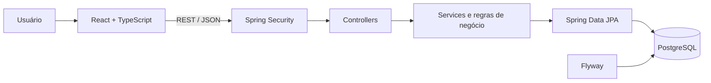
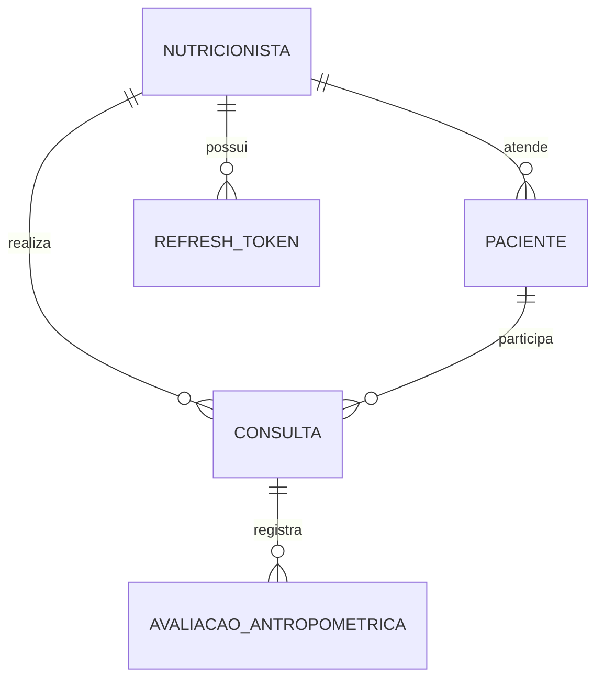
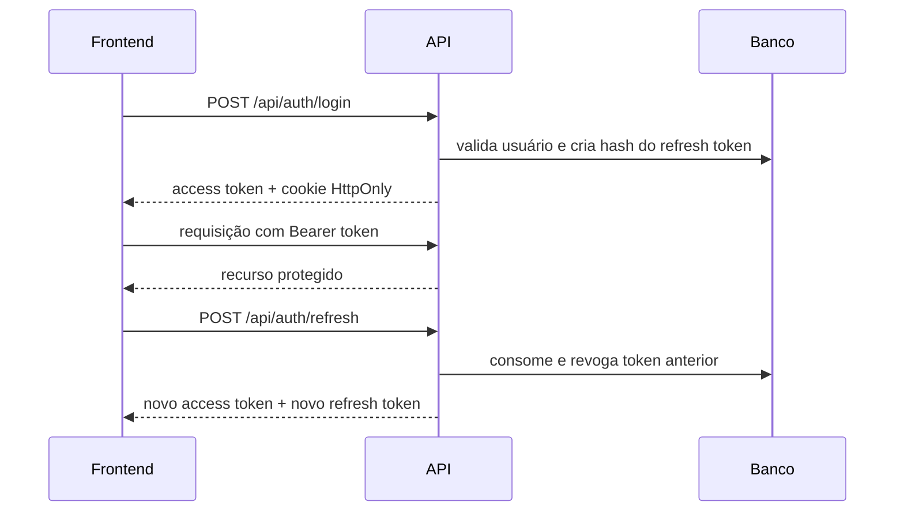

# NutriApp

Sistema full stack para gestão de atendimentos nutricionais, desenvolvido com **Java 21 + Spring Boot** no backend e **React + TypeScript** no frontend.

O projeto cobre o fluxo central de uma clínica: autenticação segura, gestão de pacientes, agendamento de consultas, avaliações antropométricas com cálculo automático da composição corporal e um dashboard com indicadores operacionais.


## Visão geral

O NutriApp foi construído para explorar problemas comuns de uma aplicação real, além de operações CRUD:

- sessões com access token JWT e refresh token rotativo;
- autorização por perfil (`ADMIN` e `NUTRICIONISTA`);
- isolamento dos dados por nutricionista autenticado;
- regras de negócio e validações no domínio;
- cálculos antropométricos reproduzíveis;
- persistência versionada com Flyway;
- dashboard agregado sem transferir coleções completas ao navegador;
- interface responsiva com temas claro e escuro.

## Funcionalidades

### Autenticação e segurança

- Login com senha protegida por BCrypt.
- JWT de curta duração enviado como Bearer token.
- Refresh token aleatório em cookie `HttpOnly`.
- Rotação do refresh token a cada renovação de sessão.
- Persistência apenas do hash SHA-256 do refresh token.
- Sessão comum ou persistente por meio de “Lembrar de mim”.
- Logout com revogação do refresh token.
- Renovação transparente da sessão pelo interceptor do Axios.
- Rotas públicas e protegidas no frontend.

### Gestão clínica

- Cadastro, consulta, edição, ativação e remoção de pacientes.
- E-mail de paciente único dentro do escopo de cada nutricionista.
- Agendamento, edição, alteração de status e remoção de consultas.
- Bloqueio de consultas para pacientes ou nutricionistas inativos.
- Avaliações antropométricas vinculadas a consultas.
- Histórico de avaliações por consulta.
- Cálculo de IMC, percentual de gordura, massa gorda e massa magra.
- Protocolos Jackson & Pollock de 3 e 7 pontos e Faulkner.

### Experiência no frontend

- Dashboard com indicadores, atendimentos mensais e próximas consultas.
- Gestão de pacientes, consultas e avaliações.
- Layout adaptado para desktop e dispositivos móveis.
- Tema claro/escuro com preferência persistida no navegador.
- Estados de carregamento, erro, listas vazias e renovação de sessão.

## Arquitetura



O backend segue uma arquitetura em camadas:

```text
controller  → contrato HTTP e status codes
service     → casos de uso, transações e regras de negócio
repository  → persistência e consultas agregadas
mapper      → conversão entre entidades e DTOs
entity      → modelo persistido
security    → autenticação, JWT e autorização
```

Entidades JPA não são expostas diretamente pela API. Requests e responses utilizam DTOs próprios, reduzindo o acoplamento entre o banco e o contrato HTTP.

### Modelo de dados



Todas as buscas clínicas usam o identificador do nutricionista autenticado. Assim, conhecer o ID de um recurso não permite acessar registros pertencentes a outro profissional.

## Fluxo de autenticação



O access token permanece somente em memória no frontend. O refresh token não fica acessível ao JavaScript, reduzindo sua exposição em caso de XSS.

## Stack

| Camada | Tecnologias |
|---|---|
| Backend | Java 21, Spring Boot 4, Spring MVC, Spring Security |
| Persistência | Spring Data JPA, PostgreSQL 17, Flyway |
| Segurança | JWT/JJWT, BCrypt, cookies HttpOnly |
| Frontend | React 19, TypeScript, Vite, React Router |
| Interface | Tailwind CSS, Base UI, Lucide, Recharts |
| Qualidade | JUnit 5, Mockito, AssertJ, MockMvc, Oxlint |
| Infraestrutura | Docker, Docker Compose, Maven Wrapper |

## Como executar

### Pré-requisitos

- Java 21;
- Node.js 20 ou superior;
- Docker e Docker Compose;
- Git.

### 1. Clone e configure

```bash
git clone https://github.com/Farcicdev/Nutri.API.git
cd Nutri.API
cp .env.example .env
```

Gere uma chave JWT Base64 segura e coloque o resultado em `JWT_SECRET`:

```bash
openssl rand -base64 32
```

### 2. Inicie o PostgreSQL

```bash
docker compose up -d database
```

O banco ficará disponível em `localhost:5435`. As tabelas são criadas automaticamente pelas migrations do Flyway.

### 3. Inicie a API

```bash
./mvnw spring-boot:run
```

A API responde em `http://localhost:8082/api`.

### 4. Inicie o frontend

Em outro terminal:

```bash
cd frontend
npm install
npm run dev
```

O Vite informa a URL local, normalmente `http://localhost:5173`. Em desenvolvimento, o proxy encaminha `/api` para `http://localhost:8082`.

### Execução da API com Docker

```bash
docker compose up --build
```

Esse comando sobe a API e o PostgreSQL. O frontend continua sendo iniciado separadamente com Vite.

## Primeiro acesso

Crie um nutricionista pelo endpoint público de cadastro:

```bash
curl -X POST http://localhost:8082/api/auth/cadastro \
  -H "Content-Type: application/json" \
  -d '{
    "nome": "Maria Oliveira",
    "email": "maria@example.com",
    "senha": "senha-segura-123",
    "telefone": "11999999999",
    "crn": "CRN-3 12345",
    "especialidade": "Nutrição clínica"
  }'
```

Depois, acesse o frontend e entre com o e-mail e a senha cadastrados.

## Principais endpoints

Todas as rotas abaixo usam o prefixo `/api`. Com exceção do cadastro, login, refresh e logout, os recursos exigem autenticação.

| Método | Endpoint | Descrição |
|---|---|---|
| `POST` | `/auth/cadastro` | Cadastra um nutricionista |
| `POST` | `/auth/login` | Inicia uma sessão |
| `POST` | `/auth/refresh` | Rotaciona a sessão |
| `POST` | `/auth/logout` | Revoga a sessão atual |
| `GET` | `/auth/me` | Retorna o usuário autenticado |
| `GET` | `/dashboard/resumo` | Retorna os indicadores do dashboard |
| `GET/POST` | `/pacientes` | Lista ou cadastra pacientes |
| `GET/PUT/DELETE` | `/pacientes/{id}` | Consulta, edita ou remove um paciente |
| `PATCH` | `/pacientes/{id}/ativo` | Ativa ou inativa um paciente |
| `GET/POST` | `/consultas` | Lista ou agenda consultas |
| `GET/PUT/DELETE` | `/consultas/{id}` | Consulta, edita ou remove uma consulta |
| `PATCH` | `/consultas/{id}/status` | Atualiza o status de uma consulta |
| `POST` | `/avaliacoes-antropometricas` | Registra e calcula uma avaliação |
| `GET` | `/avaliacoes-antropometricas/{id}` | Consulta uma avaliação |
| `GET` | `/avaliacoes-antropometricas/consulta/{id}` | Lista avaliações de uma consulta |

Os endpoints administrativos de nutricionistas exigem a role `ADMIN`.

### Formato de erros

Erros de autenticação, validação, recurso inexistente e regra de negócio seguem um contrato uniforme:

```json
{
  "message": "Descrição objetiva do problema",
  "timestamp": "2026-08-13T12:00:00"
}
```

## Decisões técnicas

- **Refresh token armazenado como hash:** um vazamento do banco não revela tokens utilizáveis.
- **Rotação em vez de reutilização:** cada refresh token é consumido uma única vez.
- **`open-in-view: false`:** força o carregamento de dados dentro da camada transacional e evita acesso acidental ao banco durante a serialização.
- **`ddl-auto: validate`:** o Hibernate valida o schema, enquanto o Flyway permanece como fonte de verdade das alterações estruturais.
- **DTOs específicos:** impedem exposição involuntária de campos sensíveis e estabilizam o contrato da API.
- **Dashboard agregado no backend:** contagens e agrupamentos são executados no banco, evitando baixar todos os registros no frontend.
- **Dados reproduzíveis nas avaliações:** sexo, idade, protocolo, fórmula e versão usados no cálculo são persistidos junto ao resultado.

## Qualidade e testes

Backend:

```bash
./mvnw test
```

Frontend:

```bash
cd frontend
npm run lint
npm run build
```

A suíte cobre validação de DTOs, regras de serviços, segurança, entidades, cálculos antropométricos e controllers. O projeto está em evolução e ainda possui ajustes pendentes na configuração do Mockito/Byte Buddy em alguns ambientes com Java 21 e em um cenário de token adulterado.

## Estrutura do repositório

```text
.
├── src/main/java/             # API Spring Boot
├── src/main/resources/
│   └── db/migration/          # Migrations Flyway
├── src/test/java/             # Testes automatizados
├── frontend/src/              # Aplicação React
├── compose.yaml               # API e PostgreSQL
├── Dockerfile                 # Build multi-stage da API
└── pom.xml                    # Dependências e build Maven
```

## Estado atual e próximos passos

O projeto está funcional como aplicação de portfólio, mas continua em desenvolvimento. Os próximos incrementos planejados são:

- corrigir os testes pendentes e ampliar a cobertura de integração;
- adicionar paginação, filtros e ordenação nas listagens;
- publicar a especificação OpenAPI/Swagger;
- permitir que o nutricionista edite o próprio perfil e senha;
- adicionar edição e exclusão de avaliações antropométricas;
- incluir testes dos fluxos críticos do frontend;
- configurar CI para build e testes;
- separar configurações de desenvolvimento e produção;
- publicar uma demonstração acessível pela internet.

## Autor

Projeto desenvolvido por **Augusto** como estudo aplicado de desenvolvimento full stack com Java, Spring Boot, React e PostgreSQL.

> Se você está avaliando este projeto em um processo seletivo, sugestões técnicas são muito bem-vindas.
